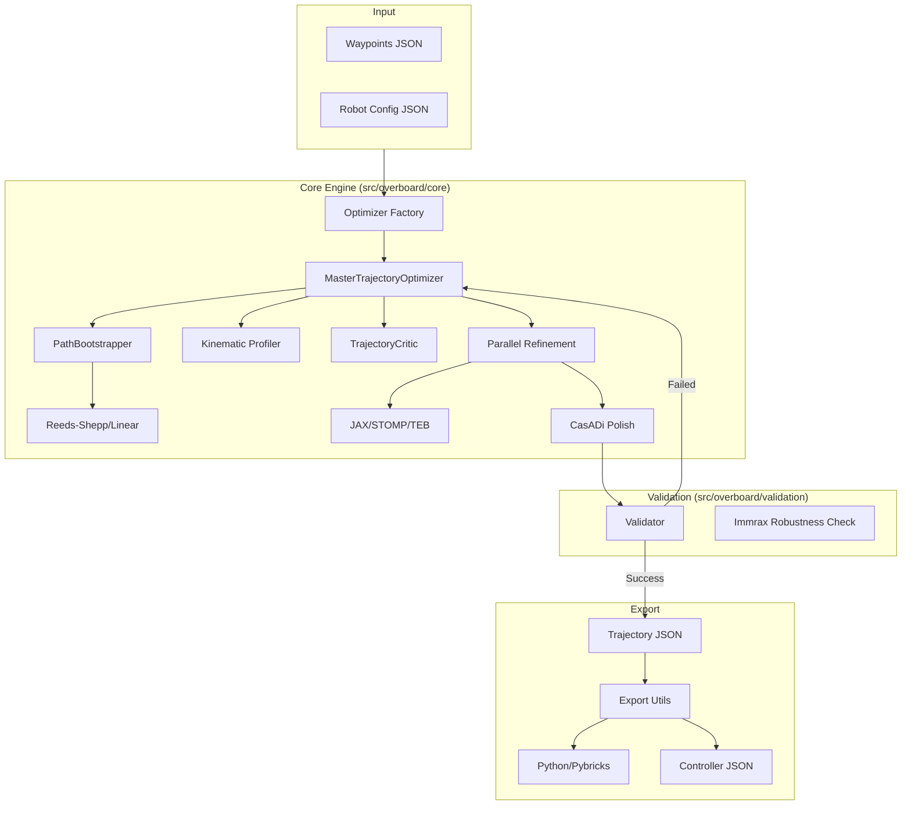

# OVERBOARD Engineering Guide

This guide is intended for developers who want to understand the internal architecture of OVERBOARD or contribute to its development.

## System Architecture

OVERBOARD is structured as a modular Python package. The core logic is separated into three main pillars: **Core (Optimizers)**, **Validation**, and **Visualization**.

### Code Flow

The following diagram illustrates how data flows through the system during a typical optimization run:



## Core Components

### 1. Unified Optimizer Interface (`core/factory.py`)
The `Optimizer` class provides a single entry point for all optimization tasks. It abstracts away the complexity of choosing between the basic CasADi-only optimizer and the advanced Multi-Verse pipeline.

### 2. Multi-Verse Pipeline (`core/multiverse_optimizer.py`)
This is the "brain" of OVERBOARD. It uses a 5-phase approach:
1. **Bootstrap**: Generates geometric seeds.
2. **Profile**: Initial fast time-parametrization.
3. **Critic**: Identifies "bad" segments using jerk and curvature metrics.
4. **Refine**: Uses JAX-accelerated STOMP and TEB heuristics in parallel to fix bad segments.
5. **Polish**: Final global optimization for continuity.

### 3. JAX Integration (`core/jax_optimizer.py`)
We use JAX for vectorized, hardware-accelerated refinement. This allows us to evaluate hundreds of trajectory variants (heuristics) in milliseconds.

### 4. Immrax Validation (`validation/immrax_validator.py`)
Immrax is used for **Reachability Analysis**. It calculates a "tube" of all possible robot positions given uncertainties in friction, mass, and motor backlash. If the tube gets too wide or hits a constraint, the trajectory is rejected.

## Development Workflow

### Adding a New Heuristic
1. Open `src/overboard/core/jax_optimizer.py`.
2. Implement your heuristic as a JAX-compatible function.
3. Register it in the `generate_candidates_jax` function.
4. It will automatically be picked up by the Multi-Verse pipeline.

### Running Tests
We use `unittest` for testing. Run all tests with:
```bash
export PYTHONPATH=$PYTHONPATH:$(pwd)/src
python run_tests.py
```

### Visualization
The `live_visualizer.py` uses WebSockets. It streams the state of the optimizer at every iteration. The frontend is vanilla JS/Canvas for maximum performance and zero build-step requirement.
